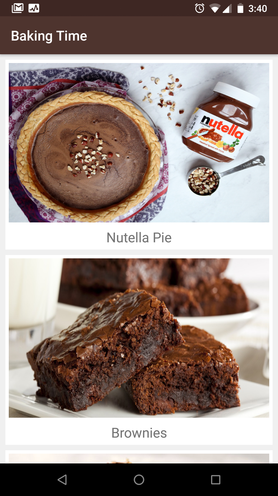
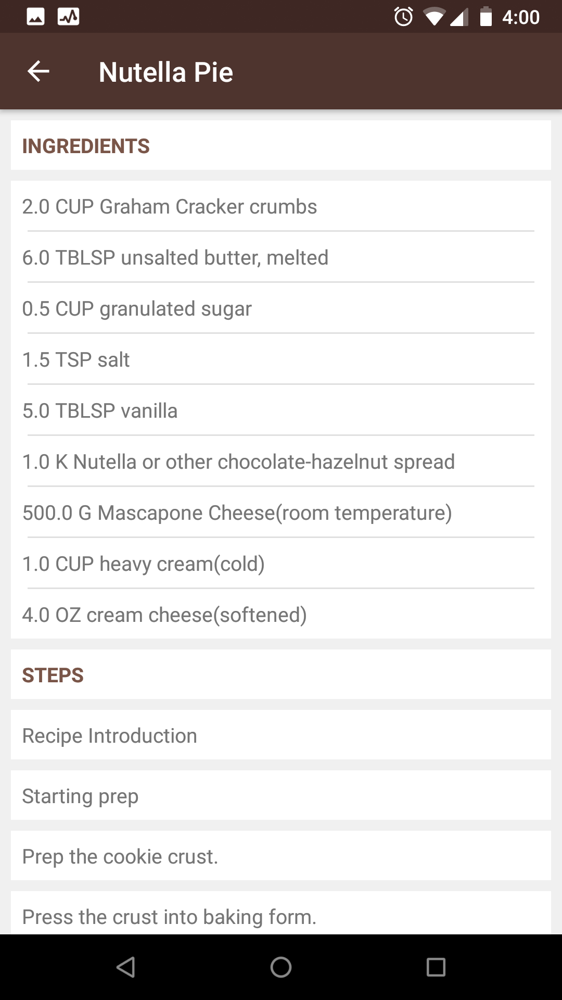
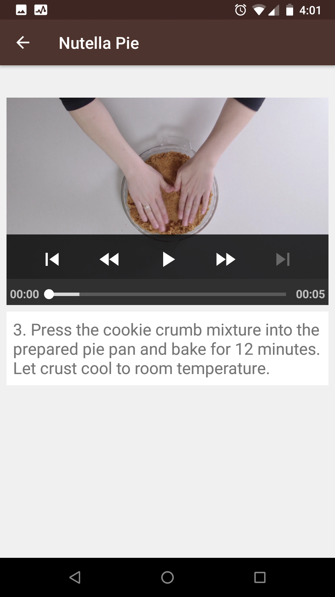
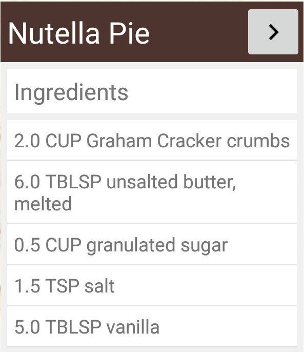

# Baking Time

## Description
An Android app that allows a user to select a recipe and see ingredients and video-guided steps for how to complete it.

## Technology used
* Java 8
* Android 9 (API 28)
* Gradle 5.1.1
* ExoPlayer 2.9.0
* Picasso 2.71828

## Features
* Displays a list of Recipe names and pictures upon launch.
* Allows the user to click on a Recipe item, and transition to a ingredients and steps screen.
* Allows the user to click on a step, and transition to a step description and video screen.
* Allows the user to navigate between recipe steps by swiping the screen left or right to view the next or previous step.
* Allows the user to read the recipe ingredients via a home screen app widget.

## Screenshots
Screen 1

Screen 2

Screen 3

App Widget

